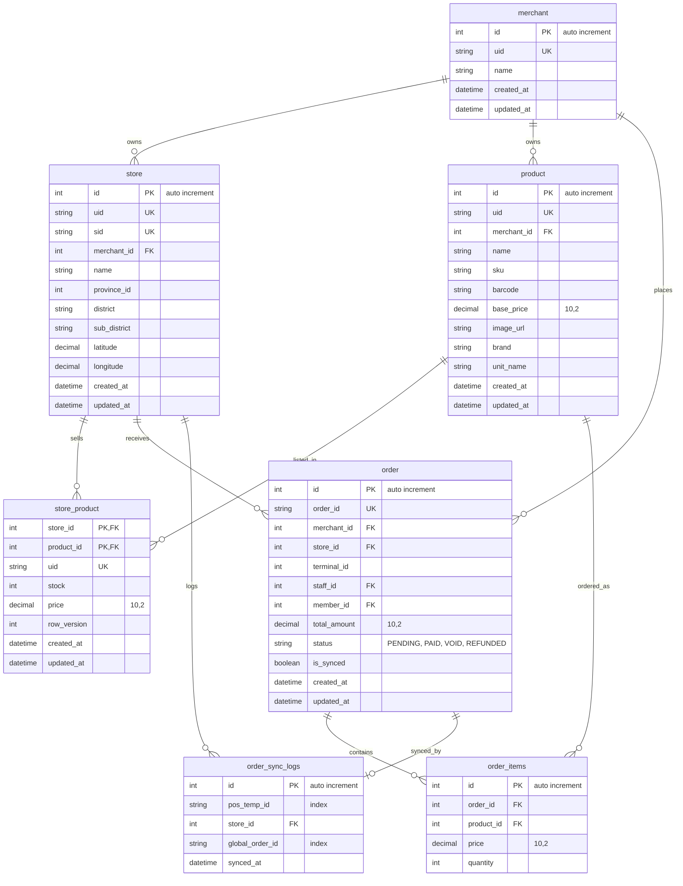

```mermaid
erDiagram
    merchant ||--o{ store : owns
    merchant ||--o{ product : owns
    store ||--o{ store_product : sells
    product ||--o{ store_product : listed_in
    merchant ||--o{ order : places
    store ||--o{ order : receives
    order ||--o{ order_items : contains
    product ||--o{ order_items : ordered_as
    store ||--o{ order_sync_logs : logs
    order ||--o| order_sync_logs : synced_by

    merchant {
        int id PK "auto increment"
        string uid UK
        string name
        datetime created_at
        datetime updated_at
    }

    store {
        int id PK "auto increment"
        string uid UK
        string sid UK
        int merchant_id FK
        string name
        int province_id
        string district
        string sub_district
        decimal latitude
        decimal longitude
        datetime created_at
        datetime updated_at
    }

    product {
        int id PK "auto increment"
        string uid UK
        int merchant_id FK
        string name
        string sku
        string barcode
        decimal base_price "10,2"
        string image_url
        string brand
        string unit_name
        datetime created_at
        datetime updated_at
    }

    store_product {
        int store_id PK,FK
        int product_id PK,FK
        string uid UK
        int stock
        decimal price "10,2"
        int row_version
        datetime created_at
        datetime updated_at
    }

    order {
        int id PK "auto increment"
        string order_id UK
        int merchant_id FK
        int store_id FK
        int terminal_id
        int staff_id FK
        int member_id FK
        decimal total_amount "10,2"
        string status "PENDING, PAID, VOID, REFUNDED"
        boolean is_synced
        datetime created_at
        datetime updated_at
    }

    order_items {
        int id PK "auto increment"
        int order_id FK
        int product_id FK
        decimal price "10,2"
        int quantity
    }

    order_sync_logs {
        int id PK "auto increment"
        string pos_temp_id "index"
        int store_id FK
        string global_order_id "index"
        datetime synced_at
    }
```
