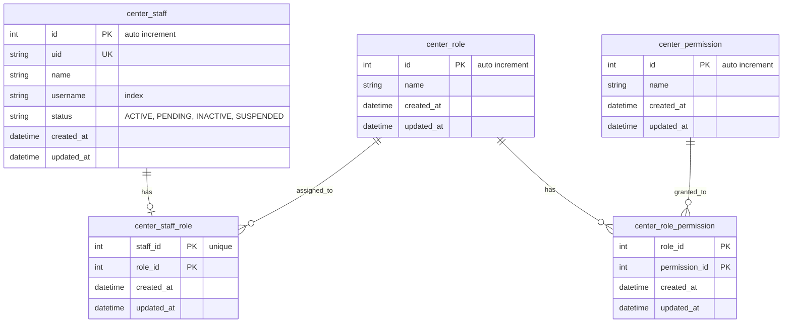

```mermaid
erDiagram
    center_staff ||--o| center_staff_role : has
    center_role ||--o{ center_staff_role : assigned_to
    center_role ||--o{ center_role_permission : has
    center_permission ||--o{ center_role_permission : granted_to

    center_staff {
        int id PK "auto increment"
        string uid UK
        string name
        string username "index"
        string status "ACTIVE, PENDING, INACTIVE, SUSPENDED"
        datetime created_at
        datetime updated_at
    }

    center_role {
        int id PK "auto increment"
        string name
        datetime created_at
        datetime updated_at
    }

    center_permission {
        int id PK "auto increment"
        string name
        datetime created_at
        datetime updated_at
    }

    center_staff_role {
        int staff_id PK "unique"
        int role_id PK
        datetime created_at
        datetime updated_at
    }

    center_role_permission {
        int role_id PK
        int permission_id PK
        datetime created_at
        datetime updated_at
    }
```
