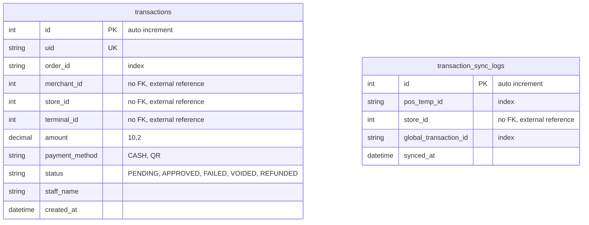

```mermaid
erDiagram
    transactions {
        int id PK "auto increment"
        string uid UK
        string order_id "index"
        int merchant_id "no FK, external reference"
        int store_id "no FK, external reference"
        int terminal_id "no FK, external reference"
        decimal amount "10,2"
        string payment_method "CASH, QR"
        string status "PENDING, APPROVED, FAILED, VOIDED, REFUNDED"
        string staff_name
        datetime created_at
    }

    transaction_sync_logs {
        int id PK "auto increment"
        string pos_temp_id "index"
        int store_id "no FK, external reference"
        string global_transaction_id "index"
        datetime synced_at
    }
```
